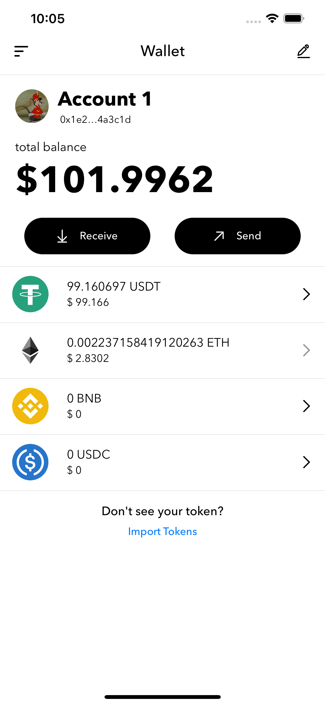

# CarnivalWallet


### Table of Contents
<ol>
  <li>
    <a href="#about-the-project">About The Project</a>
  </li>
  <li><a href="#built-with">Built With</a></li>
  <li><a href="#feature">Feature</a></li>
  <li>
    <a href="#getting-started">Getting Started</a>
    <ul>
      <li><a href="#prerequisites">Prerequisites</a></li>
      <li><a href="#installation">Installation</a></li>
    </ul>
  </li>
  <li><a href="#contributors">Contributors</a></li>
  <li><a href="#acknowledgements">Acknowledgements</a></li>
</ol>

<!-- ABOUT THE PROJECT -->
## About The Project

Carnival Wallet is a Ethereum wallet. User can import or create ethereum wallet and check ethereum balance and transaction history in this application. Also, Carnival wallet can send transaction to the node and confirm on the blockchain.


## Built With
For flexibility, the project start with UIKit, but most of the UI components are made by SwiftUI.

Tech Stack
<table>
  <tr>
    <td>Architecture</td>
    <td>MVVM+C</td>
  </tr>
  <tr>
    <td>Core</td>
    <td><a href="https://github.com/trustwallet/wallet-core">WalletCore</a></td>
  </tr>
  <tr>
    <td>Network</td>
    <td>Vanilla Swift</td>
  </tr>
  <tr>
    <td>Local storage</td>
    <td>
      CoreData, UserDefaults (managed by 
        <a href="https://github.com/sindresorhus/Defaults">Defaults</a>
      )
    </td>
  </tr>
  <tr>
    <td>Others</td>
    <td>Combine, Keychain, BigInt, QR scanner(implemented by AVFoundation)</td>
  </tr>
</table>

<!-- GETTING STARTED -->

## Getting Started

### Installation

1. Clone the repo
   ```sh
   git clone git@github.com:hanlinchentw/CarnivalWallet.git
   ```
2. Enter pod install in terminal
   ```sh
   pod install
   ```
<!-- Feature -->

## Feature

`Import existed Wallet  or Create new Wallet`
<table>
    <tr>
      <td>
        Import Wallet <br>
        
      </td>
      <td>
        Create wallet (creation) <br>
        
      </td>
      <td>
        Create wallet(validation) <br>
        
      </td>
    </tr>
</table>

`Wallet infomation overview`
<table>
    <tr>
      <td>
        Wallet page <br>
        
      </td>
      <td>
       Transaction history<br>
        
      </td>
      <td>
        Side menu <br>
        
      </td>
      <td>
       Address QRCode <br>
        
      </td>
    </tr>
</table>

`Import tokens`
<table>
    <tr>
      <td>
       Import token QRCode <br>
        
      </td>
      <td>
       Import token by pasting smart contract address<br>
        
      </td>
    </tr>
</table>

`Send transaction`
<table>
    <tr>
      <td>
       Give to address <br>
        
      </td>
      <td>
       Give transaction amount<br>
        
      </td>
      <td>
        transaction confirmation <br>
        
      </td>
    </tr>
</table>

<!-- Contributors -->

## Contributors

### iOS Developer

陳翰霖 Chen, Han-Lin - [Linkedin](https://www.linkedin.com/in/han-lin-chen-07b635200/) - s3876531@gmail.com

### UI/UX Designer

侯凱馨 Hou, Kai-Hsin - [Linkedin](https://www.linkedin.com/in/caseyhou/) - 12326casey@gmail.com

<!-- ACKNOWLEDGEMENTS -->

## Acknowledgements

- [WalletCore](https://github.com/trustwallet/wallet-core)

- [Defaults](https://github.com/sindresorhus/Defaults)
